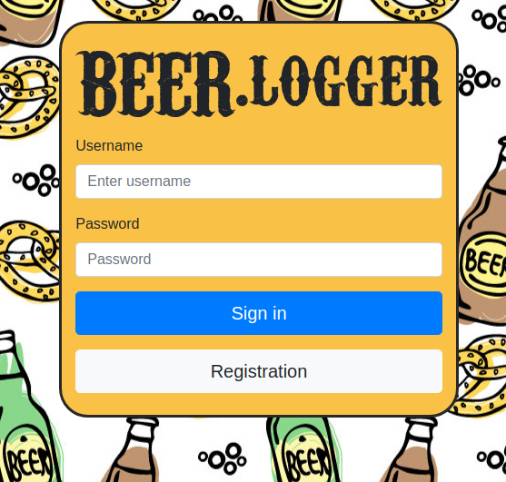
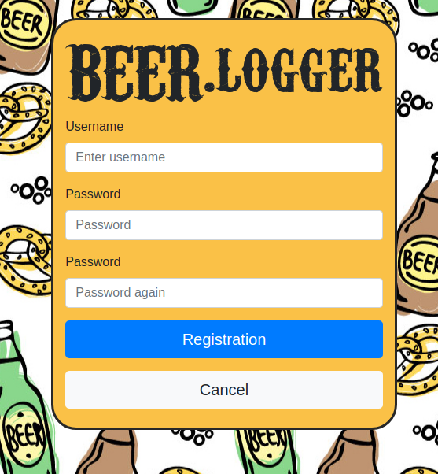
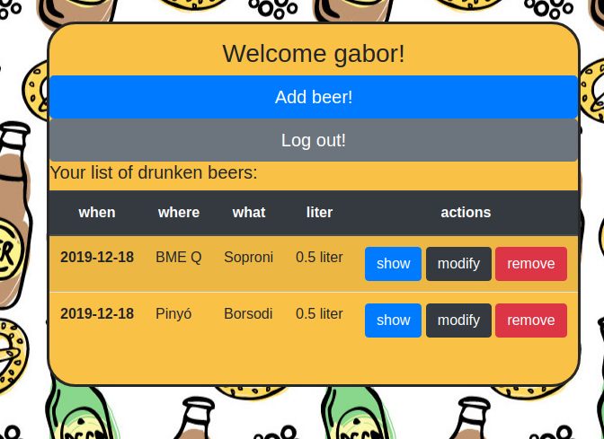
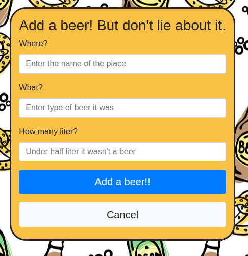
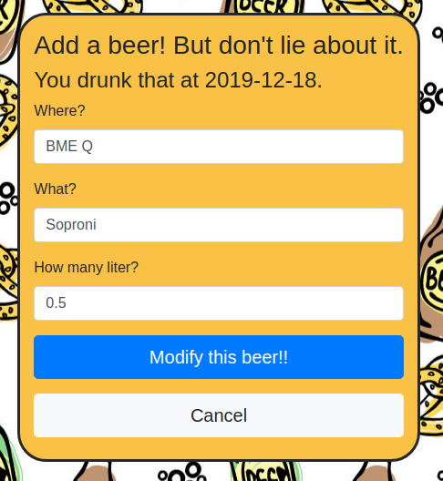
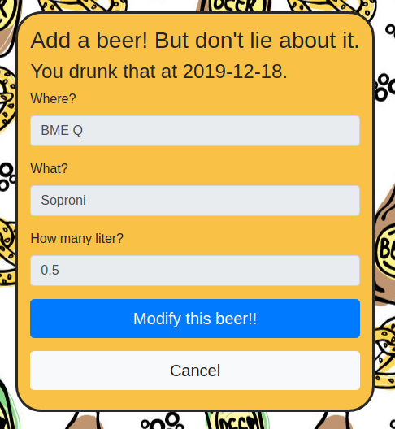

# Szerver oldali JS házi feladat specifikáció
# Alkalmazás neve: BEER.Logger

### Rövid leírás:
Az alkalmazás célja, hogy megkönnyítse a megivott sörök számon tartását a felhasználónak.

Az alkalmazás használata bejelentkezéshez kötött, 
regisztráció vagy a már felhasználói fiókkal rendelkező felhasználóknak bejelentkezés után
érhető el a sörök számon tartásának lehetősége.

Bejelentkezve a megivott sörök listáját látja a felhasználó, ebben hozzá tud adni újat, törölni, 
megnézni illetve módosítani tud.
Esetleg kijelentkezni.

A sörökről a nevüket, megivásnak dátumát, megivásnak helyét és az űrtartalmukat lehet tárolni. 
Módosítani a megivás dátuma kivételével mindent lehet.

Sör hozzáadásánál a dátum automatikusan a jelenlegi idő.

### Entitások

Az alkalmazás 2 entitást tartalmaz: User (felhasználó) és Beer (sör). 
Előbbinek csak a Create, utóbbinak összes CRUD funkcióval.

#### User entitás

Két adatot tárol, a username-et (felhasználónév) és a password-t (jelszó)

**username** - a felhasználónév, String

**password** - a jelszó hashelve, String

#### Beer entitás

5 adatot tárol: user (felhasználó), when (mikor), where (hol), what (sör neve), liter (űrtartalma)

**user** - a felhasználó, aki itta, Idegen kulcs

**when** - az időpont, hogy mikor itta, Dátum

**where** - helyszín, String

**what** - sör neve, String

**liter** - a sör űrtartalma, Double

### Nézetek

Az alkalmazás 6 nézetet tartalmaz:
* login (bejelentkezés)
* registration (regisztráció)
* mybeers (sörök listája)
* addbeer (sör hozzáadása)
* modifybeer (sör módosítása)
* showbeer (sör megnézése)

#### Login nézet

Ezen a nézeten bejelentkezni lehet a "Login" gombra kattintva, 
ami a mybeers nézetre irányít, ha sikeres a bejelentkezés. 
A felhasználónevet és a jelszót validálja, egyik sem lehet üres.

A "Registration" gombra kattintva a registration nézetre irányít.

mockup:

#### Registration nézet

Ezen a nézeten regisztrálni lehet, a "Registration" gombra kattintva,
ami sikeres regisztráció után a mybeers nézetre irányít.
Az input mezőket validálja, egyik sem lehet üres, a két jelszónak meg kell egyeznie és 
a felhasználónak nem szabad az adatbázisban szerepelnie.

A "Cancel" gombra kattintva a login nézetre irányít.

mockup:

#### mybeers nézet

Ezen a nézeten a felhasználó látja a megivott söreit, ezekhez hozzáadni tud ("Add beer!" gomb), 
illetve azokat megnézni ("show" gomb), módosítani ("modify" gomb) és törölni ("remove" gomb) tudja.

Ezen kívül a "Log out!" gombra kattintva ki tud jelentkezni.

mockup:

#### addbeer nézet

Ezen a nézeten a felhasználó új sört tud hozzá adni a megivott söreihez ("Add a beer!" gomb) 
és ezután a mybeers nézetre irányít.

Validálja az inputokat, egyik sem lehet üres és az űrtartalom csak double lehet.

A "Cancel" gombra nyomva a mybeers nézetre irányít.

mockup:

#### modifybeer nézet

Ezen a nézeten a felhasználó módosítani tud egy már általa megivott sört ("Modify this beer!" gomb) 
és ezután a mybeers nézetre irányít. 
Itt az addbeer nézettől eltérően az input mezők már ki vannak töltve a sör adataival és 
megjelenik egy dátum, ami a sör megivásának dátuma. 

Validálja az inputokat, egyik sem lehet üres és az űrtartalom csak double lehet.

A "Cancel" gombra nyomva a mybeers nézetre irányít.

mockup:

#### showbeer nézet

Ezen a nézeten a felhasználó egy már megivott sörének részleteit tudja megnézni, illetve 
a "Modify this beer!" gombra kattintva a modifybeer nézetre irányít-

A "Cancel" gombra nyomva a mybeers nézetre irányít.

mockup:

### Egyéb részletek:

A felhasználó bejelentkezését az alkalmazás egy session-ben tárolja, 
így bizonyos ideig az oldalt újra megnyitva nem kell újra bejelentkeznie, 
hanem az alkalmazás, már bejelentkezettnek tekinti.

Ha ez a session él, vagyis be van jelentkezve, akkor a login és a registration 
nézetekről automatikusan a mybeers nézetre irányít. 
Ha a session nem él, vagyis nincs bejelentkezve, akkor a login nézetre irányít.

Az alkalmazás forráskódja elérhető: 
[https://github.com/meshons/szerver-oldali-js-hazi](https://github.com/meshons/szerver-oldali-js-hazi)
